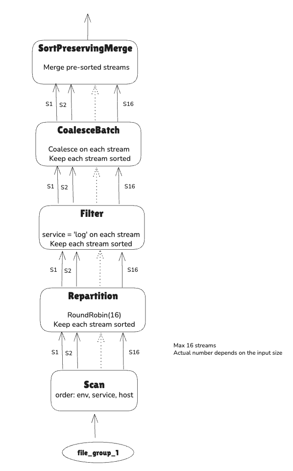
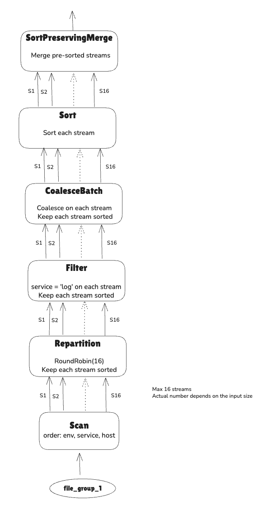

Assume you have created tables `dimension_parquet` and `dimension_parquet_sorted` shown in the file `2_cli_create_tables.md`

```SQL
SELECT * FROM dimension_parquet_sorted WHERE service = 'log' ORDER BY env, service, host;
+--------+------+---------+------+
| d_dkey | env  | service | host |
+--------+------+---------+------+
| A      | dev  | log     | ma   |
| B      | prod | log     | ma   |
| C      | prod | log     | vim  |
+--------+------+---------+------+
```

## Understand SortPreservingMergeExec


```SQL

EXPLAIN SELECT * FROM dimension_parquet_sorted WHERE service = 'log' ORDER BY env, service, host;
+---------------+----------------------------------------------------------------------------------------------------------------------------------------------------------------------------------------------------------------------------------------------------------------------------------------------------------------------------------------------------------------------------------------------------------------------------------------------------------------------------+
| plan_type     | plan                                                                                                                                                                                                                                                                                                                                                                                                                                                                       |
+---------------+----------------------------------------------------------------------------------------------------------------------------------------------------------------------------------------------------------------------------------------------------------------------------------------------------------------------------------------------------------------------------------------------------------------------------------------------------------------------------+
| logical_plan  | Sort: dimension_parquet_sorted.env ASC NULLS LAST, dimension_parquet_sorted.service ASC NULLS LAST, dimension_parquet_sorted.host ASC NULLS LAST                                                                                                                                                                                                                                                                                                                           |
|               |   Filter: dimension_parquet_sorted.service = Utf8View("log")                                                                                                                                                                                                                                                                                                                                                                                                               |
|               |     TableScan: dimension_parquet_sorted projection=[d_dkey, env, service, host], partial_filters=[dimension_parquet_sorted.service = Utf8View("log")]                                                                                                                                                                                                                                                                                                                      |
| physical_plan | SortPreservingMergeExec: [env@1 ASC NULLS LAST, service@2 ASC NULLS LAST, host@3 ASC NULLS LAST]                                                                                                                                                                                                                                                                                                                                                                           |
|               |   CoalesceBatchesExec: target_batch_size=8192                                                                                                                                                                                                                                                                                                                                                                                                                              |
|               |     FilterExec: service@2 = log                                                                                                                                                                                                                                                                                                                                                                                                                                            |
|               |       RepartitionExec: partitioning=RoundRobinBatch(16), input_partitions=1                                                                                                                                                                                                                                                                                                                                                                                                |
|               |         DataSourceExec: file_groups={1 group: [[Users/hoabinhnga.tran/datafusion-optimal-plans/testdata/dimension1/dimension_1.parquet]]}, projection=[d_dkey, env, service, host], output_ordering=[env@1 ASC NULLS LAST, service@2 ASC NULLS LAST, host@3 ASC NULLS LAST], file_type=parquet, predicate=service@2 = log, pruning_predicate=service_null_count@2 != row_count@3 AND service_min@0 <= log AND log <= service_max@1, required_guarantees=[service in (log)] |
|               |                                                                                                                                                                                                                                                                                                                                                                                                                                                                            |
+---------------+----------------------------------------------------------------------------------------------------------------------------------------------------------------------------------------------------------------------------------------------------------------------------------------------------------------------------------------------------------------------------------------------------------------------------------------------------------------------------+
2 row(s) fetched. 

```



```SQL
-- Need to sort EACH streams before merging
--    preserve_partitioning=[true]
EXPLAIN SELECT * FROM dimension_parquet WHERE service = 'log' ORDER BY env, service, host;
+---------------+-------------------------------------------------------------------------------------------------------------------------------------------------------------------------------------------------------------------------------------------------------------------------------------------------------------------------------------------------------------------------------------+
| plan_type     | plan                                                                                                                                                                                                                                                                                                                                                                                |
+---------------+-------------------------------------------------------------------------------------------------------------------------------------------------------------------------------------------------------------------------------------------------------------------------------------------------------------------------------------------------------------------------------------+
| logical_plan  | Sort: dimension_parquet.env ASC NULLS LAST, dimension_parquet.service ASC NULLS LAST, dimension_parquet.host ASC NULLS LAST                                                                                                                                                                                                                                                         |
|               |   Filter: dimension_parquet.service = Utf8View("log")                                                                                                                                                                                                                                                                                                                               |
|               |     TableScan: dimension_parquet projection=[d_dkey, env, service, host], partial_filters=[dimension_parquet.service = Utf8View("log")]                                                                                                                                                                                                                                             |
| physical_plan | SortPreservingMergeExec: [env@1 ASC NULLS LAST, service@2 ASC NULLS LAST, host@3 ASC NULLS LAST]                                                                                                                                                                                                                                                                                    |
|               |   SortExec: expr=[env@1 ASC NULLS LAST, host@3 ASC NULLS LAST], preserve_partitioning=[true]                                                                                                                                                                                                                                                                                        |
|               |     CoalesceBatchesExec: target_batch_size=8192                                                                                                                                                                                                                                                                                                                                     |
|               |       FilterExec: service@2 = log                                                                                                                                                                                                                                                                                                                                                   |
|               |         RepartitionExec: partitioning=RoundRobinBatch(16), input_partitions=1                                                                                                                                                                                                                                                                                                       |
|               |           DataSourceExec: file_groups={1 group: [[Users/hoabinhnga.tran/datafusion-optimal-plans/testdata/dimension1/dimension_1.parquet]]}, projection=[d_dkey, env, service, host], file_type=parquet, predicate=service@2 = log, pruning_predicate=service_null_count@2 != row_count@3 AND service_min@0 <= log AND log <= service_max@1, required_guarantees=[service in (log)] |
|               |                                                                                                                                                                                                                                                                                                                                                                                     |
+---------------+-------------------------------------------------------------------------------------------------------------------------------------------------------------------------------------------------------------------------------------------------------------------------------------------------------------------------------------------------------------------------------------+
2 row(s) fetched. 

```



