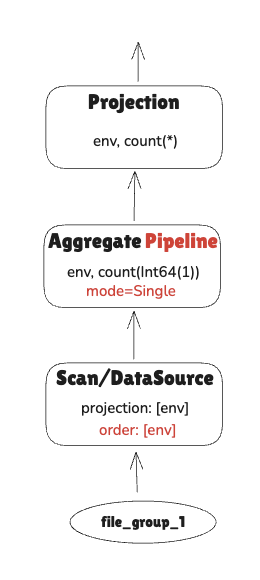
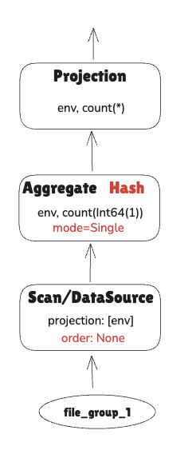
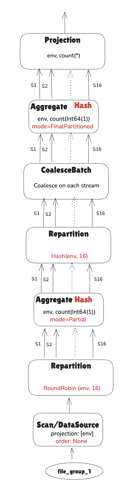
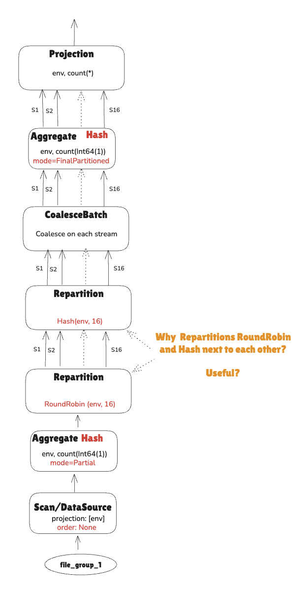
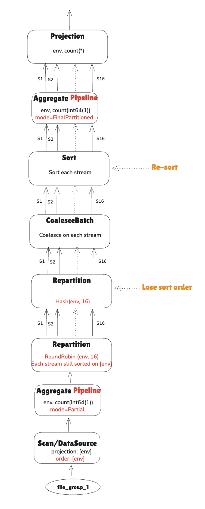
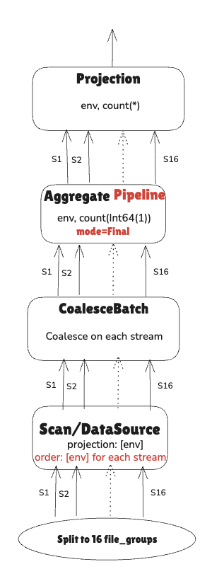
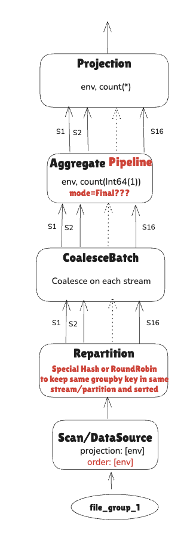

Assume you have created tables ` dimension_csv`,  `dimension_parquet` and `dimension_parquet_sorted` shown in the file `2_cli_create_tables.md`

```SQL
SELECT env, count(*) FROM dimension_parquet_sorted GROUP BY env;
+------+----------+
| env  | count(*) |
+------+----------+
| dev  | 1        |
| prod | 3        |
+------+----------+
2 row(s) fetched. 

```

## Understand Aggregation's Group-By Pipeline vs Group-By Hash

```SQL

-- Set data scan in one stream for this example
set datafusion.execution.target_partitions = 1;


-- Data is sorted on the group-by column 
--    --> Group-by Pipeline = keep streaming data up and do aggregation when hitting new key 
EXPLAIN SELECT env, count(*) FROM dimension_parquet_sorted GROUP BY env;
+---------------+--------------------------------------------------------------------------------------------------------------------------------------------------------------------------------------------------------------------+
| plan_type     | plan                                                                                                                                                                                                               |
+---------------+--------------------------------------------------------------------------------------------------------------------------------------------------------------------------------------------------------------------+
| logical_plan  | Projection: dimension_parquet_sorted.env, count(Int64(1)) AS count(*)                                                                                                                                              |
|               |   Aggregate: groupBy=[[dimension_parquet_sorted.env]], aggr=[[count(Int64(1))]]                                                                                                                                    |
|               |     TableScan: dimension_parquet_sorted projection=[env]                                                                                                                                                           |
| physical_plan | ProjectionExec: expr=[env@0 as env, count(Int64(1))@1 as count(*)]                                                                                                                                                 |
|               |   AggregateExec: mode=Single, gby=[env@0 as env], aggr=[count(Int64(1))], ordering_mode=Sorted     -- ordering_mode=Sorted is the key                                                                              |
|               |     DataSourceExec: file_groups={1 group: [[Users/hoabinhnga.tran/datafusion-optimal-plans/testdata/dimension1/dimension_1.parquet]]}, projection=[env], output_ordering=[env@0 ASC NULLS LAST], file_type=parquet |
|               |                                                                                                                                                                                                                    |
+---------------+--------------------------------------------------------------------------------------------------------------------------------------------------------------------------------------------------------------------+
2 row(s) fetched. 
```



Figure: Aggregation's Group-By Pipeline

```SQL

-- Data is NOT sorted on the group-by column
--   --> Group-By Hash: Build hash table for the group-by keys and map values there
EXPLAIN SELECT env, count(*) FROM dimension_parquet GROUP BY env;
+---------------+----------------------------------------------------------------------------------------------------------------------------------------------------------------------------+
| plan_type     | plan                                                                                                                                                                       |
+---------------+----------------------------------------------------------------------------------------------------------------------------------------------------------------------------+
| logical_plan  | Projection: dimension_parquet.env, count(Int64(1)) AS count(*)                                                                                                             |
|               |   Aggregate: groupBy=[[dimension_parquet.env]], aggr=[[count(Int64(1))]]                                                                                                   |
|               |     TableScan: dimension_parquet projection=[env]                                                                                                                          |
| physical_plan | ProjectionExec: expr=[env@0 as env, count(Int64(1))@1 as count(*)]                                                                                                         |
|               |   AggregateExec: mode=Single, gby=[env@0 as env], aggr=[count(Int64(1))]                                                                                                   |
|               |     DataSourceExec: file_groups={1 group: [[Users/hoabinhnga.tran/datafusion-optimal-plans/testdata/dimension1/dimension_1.parquet]]}, projection=[env], file_type=parquet |
|               |                                                                                                                                                                            |
+---------------+----------------------------------------------------------------------------------------------------------------------------------------------------------------------------+
2 row(s) fetched. 
```



Figure: Aggregation's Group-By Hash

## Multi-step Aggregation: Partial & Final


```SQL
-- Reset to default value
set datafusion.execution.target_partitions = 16;

-- Want to handle data in many partitions/streams and data is not yet sorted on group-by key
EXPLAIN SELECT env, count(*) FROM dimension_csv GROUP BY env;
+---------------+---------------------------------------------------------------------------------------------------------------------------------------------------------------------------------------------+
| plan_type     | plan                                                                                                                                                                                        |
+---------------+---------------------------------------------------------------------------------------------------------------------------------------------------------------------------------------------+
| logical_plan  | Projection: dimension_csv.env, count(Int64(1)) AS count(*)                                                                                                                                  |
|               |   Aggregate: groupBy=[[dimension_csv.env]], aggr=[[count(Int64(1))]]                                                                                                                        |
|               |     TableScan: dimension_csv projection=[env]                                                                                                                                               |
| physical_plan | ProjectionExec: expr=[env@0 as env, count(Int64(1))@1 as count(*)]                                                                                                                          |
|               |   AggregateExec: mode=FinalPartitioned, gby=[env@0 as env], aggr=[count(Int64(1))]                                                                                                          |
|               |     CoalesceBatchesExec: target_batch_size=8192                                                                                                                                             |
|               |       RepartitionExec: partitioning=Hash([env@0], 16), input_partitions=16                                                                                                                  |
|               |         AggregateExec: mode=Partial, gby=[env@0 as env], aggr=[count(Int64(1))]                                                                                                             |
|               |           RepartitionExec: partitioning=RoundRobinBatch(16), input_partitions=1                                                                                                             |
|               |             DataSourceExec: file_groups={1 group: [[Users/hoabinhnga.tran/datafusion-optimal-plans/testdata/dimension1/dimension_1.csv]]}, projection=[env], file_type=csv, has_header=true |
|               |                                                                                                                                                                                             |
+---------------+---------------------------------------------------------------------------------------------------------------------------------------------------------------------------------------------+
2 row(s) fetched. 

```



Figure: Multi-step Aggregation


## When RepartitionExec does not make sense and hurts performance

```SQL

EXPLAIN SELECT env, count(*) FROM dimension_parquet GROUP BY env;
+---------------+------------------------------------------------------------------------------------------------------------------------------------------------------------------------------------+
| plan_type     | plan                                                                                                                                                                               |
+---------------+------------------------------------------------------------------------------------------------------------------------------------------------------------------------------------+
| logical_plan  | Projection: dimension_parquet.env, count(Int64(1)) AS count(*)                                                                                                                     |
|               |   Aggregate: groupBy=[[dimension_parquet.env]], aggr=[[count(Int64(1))]]                                                                                                           |
|               |     TableScan: dimension_parquet projection=[env]                                                                                                                                  |
| physical_plan | ProjectionExec: expr=[env@0 as env, count(Int64(1))@1 as count(*)]                                                                                                                 |
|               |   AggregateExec: mode=FinalPartitioned, gby=[env@0 as env], aggr=[count(Int64(1))]                                                                                                 |
|               |     CoalesceBatchesExec: target_batch_size=8192                                                                                                                                    |
|               |       RepartitionExec: partitioning=Hash([env@0], 16), input_partitions=16              -- Repartition Hash                                                                        |
|               |         RepartitionExec: partitioning=RoundRobinBatch(16), input_partitions=1           -- Repartition Round Robin                                                                 |
|               |           AggregateExec: mode=Partial, gby=[env@0 as env], aggr=[count(Int64(1))]                                                                                                  |
|               |             DataSourceExec: file_groups={1 group: [[Users/hoabinhnga.tran/datafusion-optimal-plans/testdata/dimension1/dimension_1.parquet]]}, projection=[env], file_type=parquet |
|               |                                                                                                                                                                                    |
+---------------+------------------------------------------------------------------------------------------------------------------------------------------------------------------------------------+
2 row(s) fetched. 
```
 


Figure: Sub-optimal Aggregation

Better go with either plan in `Figure: Aggregation's Group-By Hash` or `Figure: Multi-step Aggregation`

- Tickett: https://github.com/apache/datafusion/issues/18341
- Reproducer in datafusion repo: https://github.com/apache/datafusion/pull/18343


## Even More Sub-optimal Plan

```SQL
-- Data is already sorted on Group-By key but the plan was so sub-optimal

    EXPLAIN SELECT env, count(*) FROM dimension_parquet_sorted GROUP BY env;
+---------------+------------------------------------------------------------------------------------------------------------------------------------------------------------------------------------------------------------------------------+
| plan_type     | plan                                                                                                                                                                                                                         |
+---------------+------------------------------------------------------------------------------------------------------------------------------------------------------------------------------------------------------------------------------+
| logical_plan  | Projection: dimension_parquet_sorted.env, count(Int64(1)) AS count(*)                                                                                                                                                        |
|               |   Aggregate: groupBy=[[dimension_parquet_sorted.env]], aggr=[[count(Int64(1))]]                                                                                                                                              |
|               |     TableScan: dimension_parquet_sorted projection=[env]                                                                                                                                                                     |
| physical_plan | ProjectionExec: expr=[env@0 as env, count(Int64(1))@1 as count(*)]                                                                                                                                                           |
|               |   AggregateExec: mode=FinalPartitioned, gby=[env@0 as env], aggr=[count(Int64(1))], ordering_mode=Sorted                                                                                                                     |
|               |     SortExec: expr=[env@0 ASC NULLS LAST], preserve_partitioning=[true]                                                                                                                                                      |
|               |       CoalesceBatchesExec: target_batch_size=8192                                                                                                                                                                            |
|               |         RepartitionExec: partitioning=Hash([env@0], 16), input_partitions=16                                                                                                                                                 |
|               |           RepartitionExec: partitioning=RoundRobinBatch(16), input_partitions=1                                                                                                                                              |
|               |             AggregateExec: mode=Partial, gby=[env@0 as env], aggr=[count(Int64(1))], ordering_mode=Sorted                                                                                                                    |
|               |               DataSourceExec: file_groups={1 group: [[Users/hoabinhnga.tran/datafusion-optimal-plans/testdata/dimension1/dimension_1.parquet]]}, projection=[env], output_ordering=[env@0 ASC NULLS LAST], file_type=parquet |
|               |                                                                                                                                                                                                                              |
+---------------+------------------------------------------------------------------------------------------------------------------------------------------------------------------------------------------------------------------------------+
2 row(s) fetched. 
```



Figure: Sub-optimal Pre-Sorted Aggregation

### Better plans:

1. Use `Single` aggregate & pipeline as in `Figure: Aggregation's Group-By Pipeline`

2. Split file groups into sorted N *     target_partitions (N = 1, 2, 3, ...)

   This strategy is especially effective when data files are already partitioned and sorted by the group-by key.

   


3. Implement a specialized Repartition strategy—either Hash or Round Robin (or a new one)—that ensures rows with the same group key are placed in the same partition and remain sorted within each stream.

    

TODO: play with configurations to see how to do this (especially for the case of many files that are already partitioned and sorted by the group-by key ), if not possible, open a  ticket for this

