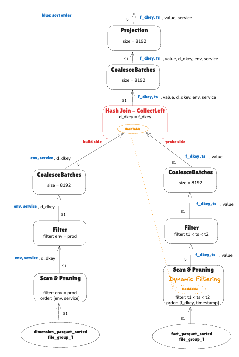
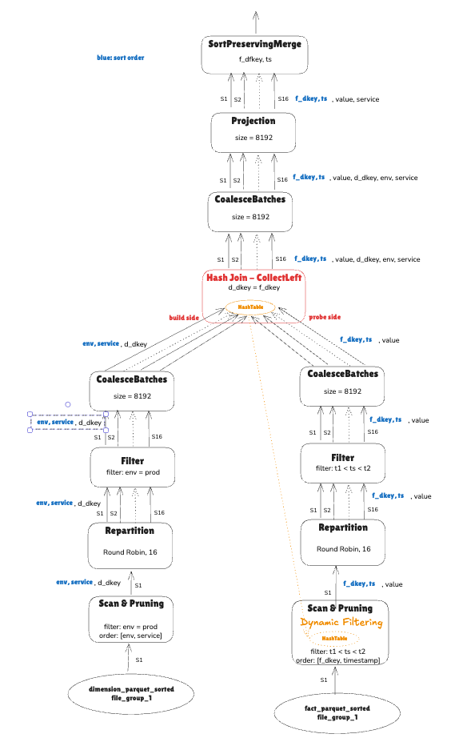

## Create two tables, each with one sorted file

```SQL
-- Note: Your data in the file must be sorted

CREATE EXTERNAL TABLE  dimension_parquet_sorted
STORED AS parquet
WITH ORDER (env, service, host)
LOCATION '/Users/hoabinhnga.tran/datafusion-optimal-plans/testdata/dimension1/';

CREATE EXTERNAL TABLE  fact_parquet_sorted
STORED AS parquet
WITH ORDER (f_dkey, timestamp)
LOCATION '/Users/hoabinhnga.tran/datafusion-optimal-plans/testdata/fact1/';

SELECT * FROM  dimension_parquet_sorted;
+--------+------+---------+------+
| d_dkey | env  | service | host |
+--------+------+---------+------+
| A      | dev  | log     | ma   |
| B      | prod | log     | ma   |
| C      | prod | log     | vim  |
| D      | prod | trace   | vim  |
+--------+------+---------+------+
4 row(s) fetched. 

SELECT * FROM fact_parquet_sorted;
+--------+---------------------+-------+
| f_dkey | timestamp           | value |
+--------+---------------------+-------+
| A      | 2023-01-01T09:00:00 | 95.5  |
| A      | 2023-01-01T09:00:10 | 102.3 |
| A      | 2023-01-01T09:00:20 | 98.7  |
| A      | 2023-01-01T09:12:20 | 105.1 |
| A      | 2023-01-01T09:12:30 | 100.0 |
| A      | 2023-01-01T09:12:40 | 150.0 |
| A      | 2023-01-01T09:12:50 | 120.8 |
| B      | 2023-01-01T09:00:00 | 75.2  |
| B      | 2023-01-01T09:00:10 | 82.4  |
| B      | 2023-01-01T09:00:20 | 78.9  |
| B      | 2023-01-01T09:00:30 | 85.6  |
| B      | 2023-01-01T09:12:30 | 80.0  |
| B      | 2023-01-01T09:12:40 | 120.0 |
| B      | 2023-01-01T09:12:50 | 92.3  |
| C      | 2023-01-01T09:00:00 | 300.5 |
| C      | 2023-01-01T09:00:10 | 285.7 |
| C      | 2023-01-01T09:00:20 | 310.2 |
| C      | 2023-01-01T09:00:30 | 295.8 |
| C      | 2023-01-01T09:00:40 | 300.0 |
| C      | 2023-01-01T09:12:40 | 250.0 |
| C      | 2023-01-01T09:12:50 | 275.4 |
+--------+---------------------+-------+
21 row(s) fetched. 

```

## Join Query

```SQL

SET datafusion.explain.format = 'indent';


SELECT f.f_dkey, f.timestamp, f.value, d.service
FROM   dimension_parquet_sorted d, fact_parquet_sorted f
WHERE  d.d_dkey = f.f_dkey
    AND d.env = 'prod'
    AND timestamp > TIMESTAMP '2023-01-01T08:00:00'
    AND timestamp <> TIMESTAMP '2023-01-01T12:00:00'
ORDER BY f.f_dkey, timestamp;
+--------+---------------------+-------+---------+
| f_dkey | timestamp           | value | service |
+--------+---------------------+-------+---------+
| B      | 2023-01-01T09:00:00 | 75.2  | log     |
| B      | 2023-01-01T09:00:10 | 82.4  | log     |
| B      | 2023-01-01T09:00:20 | 78.9  | log     |
| B      | 2023-01-01T09:00:30 | 85.6  | log     |
| B      | 2023-01-01T09:12:30 | 80.0  | log     |
| B      | 2023-01-01T09:12:40 | 120.0 | log     |
| B      | 2023-01-01T09:12:50 | 92.3  | log     |
| C      | 2023-01-01T09:00:00 | 300.5 | log     |
| C      | 2023-01-01T09:00:10 | 285.7 | log     |
| C      | 2023-01-01T09:00:20 | 310.2 | log     |
| C      | 2023-01-01T09:00:30 | 295.8 | log     |
| C      | 2023-01-01T09:00:40 | 300.0 | log     |
| C      | 2023-01-01T09:12:40 | 250.0 | log     |
| C      | 2023-01-01T09:12:50 | 275.4 | log     |
+--------+---------------------+-------+---------+
14 row(s) fetched. 
```

## Keep the data flow within a single stream or partition

```SQL

SET datafusion.execution.target_partitions = 1;

explain SELECT f.f_dkey, f.timestamp, f.value, d.service
FROM   dimension_parquet_sorted d, fact_parquet_sorted f
WHERE  d.d_dkey = f.f_dkey
    AND d.env = 'prod'
    AND timestamp > TIMESTAMP '2023-01-01T08:00:00'
    AND timestamp <> TIMESTAMP '2023-01-01T12:00:00'
ORDER BY f.f_dkey, timestamp;
+---------------+-------------------------------------------------------------------------------------------------------------------------------------------------------------------------------------------------------------------------------------------------------------------------------------------------------------------------------------------------------------------------------------------------------------------------------------------------------------------------------------------------------------------------------------------------------------------------------------------------------------------------------------------------------------------------------------------------+
| plan_type     | plan                                                                                                                                                                                                                                                                                                                                                                                                                                                                                                                                                                                                                                                                                            |
+---------------+-------------------------------------------------------------------------------------------------------------------------------------------------------------------------------------------------------------------------------------------------------------------------------------------------------------------------------------------------------------------------------------------------------------------------------------------------------------------------------------------------------------------------------------------------------------------------------------------------------------------------------------------------------------------------------------------------+
| logical_plan  | Sort: f.f_dkey ASC NULLS LAST, f.timestamp ASC NULLS LAST                                                                                                                                                                                                                                                                                                                                                                                                                                                                                                                                                                                                                                       |
|               |   Projection: f.f_dkey, f.timestamp, f.value, d.service                                                                                                                                                                                                                                                                                                                                                                                                                                                                                                                                                                                                                                         |
|               |     Inner Join: d.d_dkey = f.f_dkey                                                                                                                                                                                                                                                                                                                                                                                                                                                                                                                                                                                                                                                             |
|               |       SubqueryAlias: d                                                                                                                                                                                                                                                                                                                                                                                                                                                                                                                                                                                                                                                                          |
|               |         Projection: dimension_parquet_sorted.d_dkey, dimension_parquet_sorted.service                                                                                                                                                                                                                                                                                                                                                                                                                                                                                                                                                                                                           |
|               |           Filter: dimension_parquet_sorted.env = Utf8View("prod")                                                                                                                                                                                                                                                                                                                                                                                                                                                                                                                                                                                                                               |
|               |             TableScan: dimension_parquet_sorted projection=[d_dkey, env, service], partial_filters=[dimension_parquet_sorted.env = Utf8View("prod")]                                                                                                                                                                                                                                                                                                                                                                                                                                                                                                                                            |
|               |       SubqueryAlias: f                                                                                                                                                                                                                                                                                                                                                                                                                                                                                                                                                                                                                                                                          |
|               |         Filter: fact_parquet_sorted.timestamp > TimestampNanosecond(1672560000000000000, None) AND fact_parquet_sorted.timestamp != TimestampNanosecond(1672574400000000000, None)                                                                                                                                                                                                                                                                                                                                                                                                                                                                                                              |
|               |           TableScan: fact_parquet_sorted projection=[f_dkey, timestamp, value], partial_filters=[fact_parquet_sorted.timestamp > TimestampNanosecond(1672560000000000000, None), fact_parquet_sorted.timestamp != TimestampNanosecond(1672574400000000000, None)]                                                                                                                                                                                                                                                                                                                                                                                                                               |
| physical_plan | ProjectionExec: expr=[f_dkey@1 as f_dkey, timestamp@2 as timestamp, value@3 as value, service@0 as service]                                                                                                                                                                                                                                                                                                                                                                                                                                                                                                                                                                                     |
|               |   CoalesceBatchesExec: target_batch_size=8192                                                                                                                                                                                                                                                                                                                                                                                                                                                                                                                                                                                                                                                   |
|               |     HashJoinExec: mode=CollectLeft, join_type=Inner, on=[(d_dkey@0, f_dkey@0)], projection=[service@1, f_dkey@2, timestamp@3, value@4]                                                                                                                                                                                                                                                                                                                                                                                                                                                                                                                                                          |
|               |       CoalesceBatchesExec: target_batch_size=8192                                                                                                                                                                                                                                                                                                                                                                                                                                                                                                                                                                                                                                               |
|               |         FilterExec: env@1 = prod, projection=[d_dkey@0, service@2]                                                                                                                                                                                                                                                                                                                                                                                                                                                                                                                                                                                                                              |
|               |           DataSourceExec: file_groups={1 group: [[Users/hoabinhnga.tran/datafusion-optimal-plans/testdata/dimension1/dimension_1.parquet]]}, projection=[d_dkey, env, service], output_ordering=[env@1 ASC NULLS LAST, service@2 ASC NULLS LAST], file_type=parquet, predicate=env@1 = prod, pruning_predicate=env_null_count@2 != row_count@3 AND env_min@0 <= prod AND prod <= env_max@1, required_guarantees=[env in (prod)]                                                                                                                                                                                                                                                                 |
|               |       CoalesceBatchesExec: target_batch_size=8192                                                                                                                                                                                                                                                                                                                                                                                                                                                                                                                                                                                                                                               |
|               |         FilterExec: timestamp@1 > 1672560000000000000 AND timestamp@1 != 1672574400000000000                                                                                                                                                                                                                                                                                                                                                                                                                                                                                                                                                                                                    |
|               |           DataSourceExec: file_groups={1 group: [[Users/hoabinhnga.tran/datafusion-optimal-plans/testdata/fact1/fact_1.parquet]]}, projection=[f_dkey, timestamp, value], output_ordering=[f_dkey@0 ASC NULLS LAST, timestamp@1 ASC NULLS LAST], file_type=parquet, predicate=timestamp@1 > 1672560000000000000 AND timestamp@1 != 1672574400000000000 AND DynamicFilterPhysicalExpr [ true ], pruning_predicate=timestamp_null_count@1 != row_count@2 AND timestamp_max@0 > 1672560000000000000 AND timestamp_null_count@1 != row_count@2 AND (timestamp_min@3 != 1672574400000000000 OR 1672574400000000000 != timestamp_max@0), required_guarantees=[timestamp not in (1672574400000000000)] |
|               |                                                                                                                                                                                                                                                                                                                                                                                                                                                                                                                                                                                                                                                                                                 |
+---------------+-------------------------------------------------------------------------------------------------------------------------------------------------------------------------------------------------------------------------------------------------------------------------------------------------------------------------------------------------------------------------------------------------------------------------------------------------------------------------------------------------------------------------------------------------------------------------------------------------------------------------------------------------------------------------------------------------+
2 row(s) fetched. 

```

Note: No SortExec because data is already sorted on `f_dkey, timestamp`




## Multi-stream/partition

```SQL

SET datafusion.execution.target_partitions = 16;

explain SELECT f.f_dkey, f.timestamp, f.value, d.service
FROM   dimension_parquet_sorted d, fact_parquet_sorted f
WHERE  d.d_dkey = f.f_dkey
    AND d.env = 'prod'
    AND timestamp > TIMESTAMP '2023-01-01T08:00:00'
    AND timestamp <> TIMESTAMP '2023-01-01T12:00:00'
ORDER BY f.f_dkey, timestamp;
+---------------+-----------------------------------------------------------------------------------------------------------------------------------------------------------------------------------------------------------------------------------------------------------------------------------------------------------------------------------------------------------------------------------------------------------------------------------------------------------------------------------------------------------------------------------------------------------------------------------------------------------------------------------------------------------------------------------------------------+
| plan_type     | plan                                                                                                                                                                                                                                                                                                                                                                                                                                                                                                                                                                                                                                                                                                |
+---------------+-----------------------------------------------------------------------------------------------------------------------------------------------------------------------------------------------------------------------------------------------------------------------------------------------------------------------------------------------------------------------------------------------------------------------------------------------------------------------------------------------------------------------------------------------------------------------------------------------------------------------------------------------------------------------------------------------------+
| logical_plan  | Sort: f.f_dkey ASC NULLS LAST, f.timestamp ASC NULLS LAST                                                                                                                                                                                                                                                                                                                                                                                                                                                                                                                                                                                                                                           |
|               |   Projection: f.f_dkey, f.timestamp, f.value, d.service                                                                                                                                                                                                                                                                                                                                                                                                                                                                                                                                                                                                                                             |
|               |     Inner Join: d.d_dkey = f.f_dkey                                                                                                                                                                                                                                                                                                                                                                                                                                                                                                                                                                                                                                                                 |
|               |       SubqueryAlias: d                                                                                                                                                                                                                                                                                                                                                                                                                                                                                                                                                                                                                                                                              |
|               |         Projection: dimension_parquet_sorted.d_dkey, dimension_parquet_sorted.service                                                                                                                                                                                                                                                                                                                                                                                                                                                                                                                                                                                                               |
|               |           Filter: dimension_parquet_sorted.env = Utf8View("prod")                                                                                                                                                                                                                                                                                                                                                                                                                                                                                                                                                                                                                                   |
|               |             TableScan: dimension_parquet_sorted projection=[d_dkey, env, service], partial_filters=[dimension_parquet_sorted.env = Utf8View("prod")]                                                                                                                                                                                                                                                                                                                                                                                                                                                                                                                                                |
|               |       SubqueryAlias: f                                                                                                                                                                                                                                                                                                                                                                                                                                                                                                                                                                                                                                                                              |
|               |         Filter: fact_parquet_sorted.timestamp > TimestampNanosecond(1672560000000000000, None) AND fact_parquet_sorted.timestamp != TimestampNanosecond(1672574400000000000, None)                                                                                                                                                                                                                                                                                                                                                                                                                                                                                                                  |
|               |           TableScan: fact_parquet_sorted projection=[f_dkey, timestamp, value], partial_filters=[fact_parquet_sorted.timestamp > TimestampNanosecond(1672560000000000000, None), fact_parquet_sorted.timestamp != TimestampNanosecond(1672574400000000000, None)]                                                                                                                                                                                                                                                                                                                                                                                                                                   |
| physical_plan | SortPreservingMergeExec: [f_dkey@0 ASC NULLS LAST, timestamp@1 ASC NULLS LAST]                                                                                                                                                                                                                                                                                                                                                                                                                                                                                                                                                                                                                      |
|               |   ProjectionExec: expr=[f_dkey@1 as f_dkey, timestamp@2 as timestamp, value@3 as value, service@0 as service]                                                                                                                                                                                                                                                                                                                                                                                                                                                                                                                                                                                       |
|               |     CoalesceBatchesExec: target_batch_size=8192                                                                                                                                                                                                                                                                                                                                                                                                                                                                                                                                                                                                                                                     |
|               |       HashJoinExec: mode=CollectLeft, join_type=Inner, on=[(d_dkey@0, f_dkey@0)], projection=[service@1, f_dkey@2, timestamp@3, value@4]                                                                                                                                                                                                                                                                                                                                                                                                                                                                                                                                                            |
|               |         CoalescePartitionsExec                                                                                                                                                                                                                                                                                                                                                                                                                                                                                                                                                                                                                                                                      |
|               |           CoalesceBatchesExec: target_batch_size=8192                                                                                                                                                                                                                                                                                                                                                                                                                                                                                                                                                                                                                                               |
|               |             FilterExec: env@1 = prod, projection=[d_dkey@0, service@2]                                                                                                                                                                                                                                                                                                                                                                                                                                                                                                                                                                                                                              |
|               |               RepartitionExec: partitioning=RoundRobinBatch(16), input_partitions=1                                                                                                                                                                                                                                                                                                                                                                                                                                                                                                                                                                                                                 |
|               |                 DataSourceExec: file_groups={1 group: [[Users/hoabinhnga.tran/datafusion-optimal-plans/testdata/dimension1/dimension_1.parquet]]}, projection=[d_dkey, env, service], output_ordering=[env@1 ASC NULLS LAST, service@2 ASC NULLS LAST], file_type=parquet, predicate=env@1 = prod, pruning_predicate=env_null_count@2 != row_count@3 AND env_min@0 <= prod AND prod <= env_max@1, required_guarantees=[env in (prod)]                                                                                                                                                                                                                                                               |
|               |         CoalesceBatchesExec: target_batch_size=8192                                                                                                                                                                                                                                                                                                                                                                                                                                                                                                                                                                                                                                                 |
|               |           FilterExec: timestamp@1 > 1672560000000000000 AND timestamp@1 != 1672574400000000000                                                                                                                                                                                                                                                                                                                                                                                                                                                                                                                                                                                                      |
|               |             RepartitionExec: partitioning=RoundRobinBatch(16), input_partitions=1                                                                                                                                                                                                                                                                                                                                                                                                                                                                                                                                                                                                                   |
|               |               DataSourceExec: file_groups={1 group: [[Users/hoabinhnga.tran/datafusion-optimal-plans/testdata/fact1/fact_1.parquet]]}, projection=[f_dkey, timestamp, value], output_ordering=[f_dkey@0 ASC NULLS LAST, timestamp@1 ASC NULLS LAST], file_type=parquet, predicate=timestamp@1 > 1672560000000000000 AND timestamp@1 != 1672574400000000000 AND DynamicFilterPhysicalExpr [ true ], pruning_predicate=timestamp_null_count@1 != row_count@2 AND timestamp_max@0 > 1672560000000000000 AND timestamp_null_count@1 != row_count@2 AND (timestamp_min@3 != 1672574400000000000 OR 1672574400000000000 != timestamp_max@0), required_guarantees=[timestamp not in (1672574400000000000)] |
|               |                                                                                                                                                                                                                                                                                                                                                                                                                                                                                                                                                                                                                                                                                                     |
+---------------+-----------------------------------------------------------------------------------------------------------------------------------------------------------------------------------------------------------------------------------------------------------------------------------------------------------------------------------------------------------------------------------------------------------------------------------------------------------------------------------------------------------------------------------------------------------------------------------------------------------------------------------------------------------------------------------------------------+
2 row(s) fetched. 
```



- HashJoin with mode=CollectLeft:
    - Still one hash table for all build-side streams
    - Probe-side streams are running in parallel and outout stay sorted
    - Need SortPreservingMerge to merge sorted stream to have output data fully sorted without the need for extra Sort operation

- HashJoin with mode=CollectLeft:
   - A **single** hash table is built from all build-side streams.
   - Probe-side streams run in parallel, and their outputs remain sorted.
   - A SortPreservingMerge is required to combine the sorted probe outputs into a fully sorted result—avoiding the need for an additional Sort operation.


## More Advanced Join

- **Merge Join**: Boht table sorted on join keys
- **Partitioned Hash Join**: many well partitioned files both sides --> many hash tables (todo)